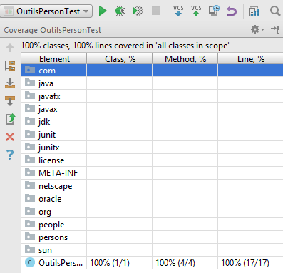

**Nom/Prénom Etudiant 1 : MARTIN Gaëtan**

**Nom/Prénom Etudiant 2 : JOYMANGUL Jensen**

# Rapport TP3

## Tests boite noire

### Question 1

Deux méthodes sont à tester : 

```java
int getAge(GregorianCalendar date)
boolean wasBorn(GregorianCalendar date)
```

Ces deux méthodes prennent en paramètre d'entrée une date de type GregorianCalendar. 
Plusieurs classes d'équivalences apparaissent alors : 
- Si la date est passée (par rapport à l'anniversaire)
- Le jour de l'anniversaire
- Une Date future
- La date d'aujourd'hui
- Une date nulle
- L'age pour une année bissectile

+ #### Pour wasBorn

| Classes     | Validité | Représentant | oracle | Contexte         |
|-------------|----------|--------------|--------|------------------|
| Date passée | Valide   | 30/03/1992   | false  | Né le 03/12/1993 |
| Date exacte | Valide   | 03/12/1993   | true   | Né le 03/12/1993 |
| Date future | Valide   | 30/05/2017   | true   | Né le 03/12/1993 |
| Date nulle  | Invalide | null         | echec  | Né le 03/12/1993 |

+ #### Pour getAge

| Classes              | Validité | Représentant | oracle | Contexte         |
|----------------------|----------|--------------|--------|------------------|
| Date avant naissance | Invalide | 04/04/1992   | Echec  | Né le 03/12/1993 |
| Date après naissance | Valide   | 04/05/2017   | 23     | Né le 03/12/1993 |
| Date d'anniversaire  | Valide   | 03/12/1993   | 0      | Né le 03/12/1993 |
| Date moins d'un an   | Valide   | 01/01/1994   | 0      | Né le 03/12/1993 |
| Date bisectile       | Valide   | 29/02/2000   | 6      | Né le 03/12/1993 |
| Date nulle           | Invalide | null         | Echec  | Né le 03/12/1993 |


### Question 2

Tous les tests sont validés sauf 1 : 

```java
/**
 * Ignore because this test should pass
 */
@Test
@Ignore
public void should_give_false_on_previous_date_wasBorn() {
    // Given
    testDate = new GregorianCalendar(1993, 12, 2);

    // When
    boolean wasBorn = person.wasBorn(testDate);

    // Then
    assertThat(wasBorn).isFalse();
}
```

En effet, wasBorn devrait renvoyé false si on passe en paramètre une date antétieure à la date de naissance
(ici date_naissance = 03/12/1993 et testDate = 02/12/1993)

### Question 3

On a créé une classe abstraite AbscractPersonneTest

Ainsi pour tester toutes les implémentations de IPerson, il suffit de créer une 
nouvelle classe héritant de AbstractPersonneTest et de surcharger les méthodes nécessaires :

```java
@Before
protected void setUp() {
    iPerson = new Person("Jensen", "JOYMANGUL", BIRTHYEAR, BIRTHMONTH, BIRTHDAY);
}
```

### Question 4

Etendre toutes les classes implémentant IPerson : 

    EfficientPerson, OneMorePerson, Person, SimplePerson, SmallCodePerson
    
Sont testées par les classes : 
    
    EfficientPersonTest, OneMorePersonTest, PersonTest, SimplePersonTest, SmallCodePersonTest
    
### Question 5

Pattern adapter appliqué avec la classe PersonneAdapter

## Tests en isolation et Mock

### Question 6

Voir la classe OutilsPerson. 

```java
public List<IPerson> getPersonsInRangeAge(List<IPerson> persons, GregorianCalendar date, int ageMin, int ageMax)
```

### Question 7

Voir la classe OutilsPerson.

```java
public int getMaxAge(List<IPerson> persons, GregorianCalendar date)
```

### Question 8

Voir la classe OutilsPersonTest. 

+ Génération des données de test :

```java
@Before
public void setUp() {

    this.persons = new ArrayList<>();
    this.testDate = new GregorianCalendar(2000, 10, 5);
    //this.testDate = any(GregorianCalendar.class);

    Person person = Mockito.mock(Person.class);
    Mockito.when(person.getAge(testDate)).thenReturn(10);
    persons.add(person);
    person = Mockito.mock(Person.class);
    Mockito.when(person.getAge(this.testDate)).thenReturn(20);
    persons.add(person);
}
```
+ Appel des méthodes tests :

```java
@Test
public void testRangePersons() {
    assertThat(OutilsPerson.getInstance().getPersonsInRangeAge(this.persons, testDate, 15, 25).size()).isEqualTo(1);
}

@Test
public void testMaxAge() {
    assertThat(OutilsPerson.getInstance().getMaxAge(this.persons, this.testDate)).isEqualTo(20);
}

@Test(expected = IllegalArgumentException.class)
public void should_get_illegal_argument_exception() {
    OutilsPerson.getInstance().getPersonsInRangeAge(this.persons, this.testDate, 25, 15);
}
```

### Question 9

Avec l'outil coverage d'Intellij :



Note : pour obtenir le 100%, nous avons été obligé de transformer OutilsPersonne en singleton 
au lieu d'utiliser des méthodes statiques (il manquait le % du constructeur inutilisé) : 
```java
public class OutilsPerson {

    private static OutilsPerson instance;

    private OutilsPerson() {}

    public static OutilsPerson getInstance() {
        if (instance == null) {
            instance = new OutilsPerson();
        }
        return instance;
    }
```


### Question 10

Utilisation de la méthode verify de Mockito avec les fonctions never pour vérifier que les noms sont jamais utilisés
et atLeastOne pour s'assurer que getAge est au moins appelée une fois. 
Il suffit d'appeler la méthode ci-dessous après les tests : 

```java
/**
 * Check that the mocks are anonymously filling the persons
 */
@After
private void verifyDataAreAnonymouslyCalled() {
    for(IPerson person : this.persons) {
        verify(person, never()).getFirstName();
        verify(person, never()).getName();
        verify(person, atLeastOnce()).getAge(any(GregorianCalendar.class));
    }
}
```

Note : pour certains tests, la méthode getAge n'est pas appellée, on a donc le message : 
```
Wanted but not invoked:
person.getAge(<any>);
-> at OutilsPersonTest.verifyDataAreAnonymouslyCalled(OutilsPersonTest.java:81)
Actually, there were zero interactions with this mock.
```